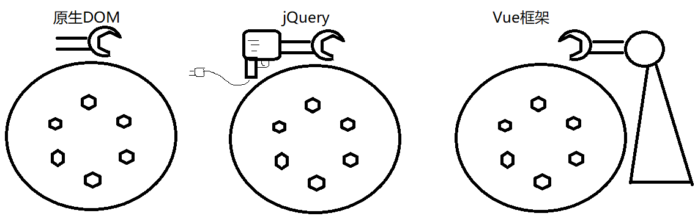
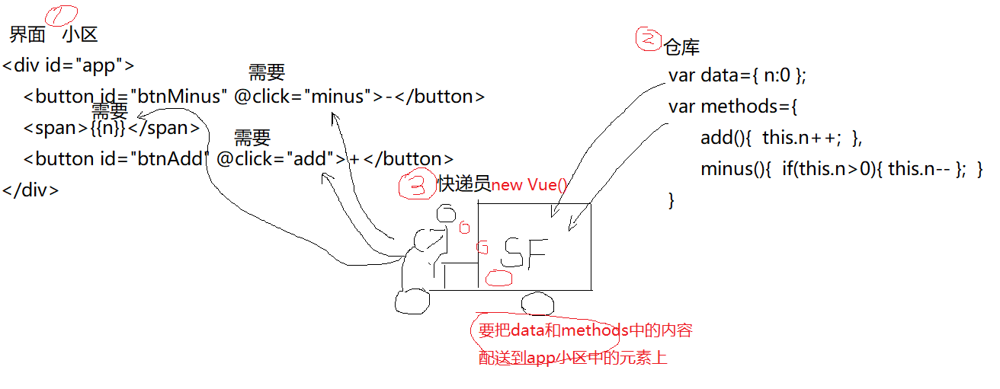
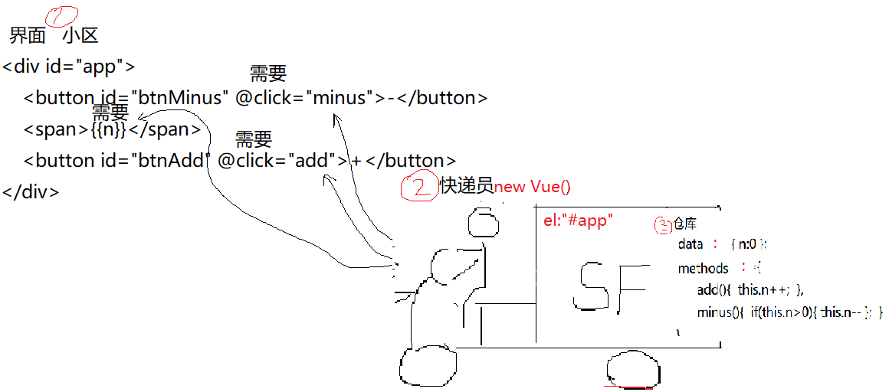
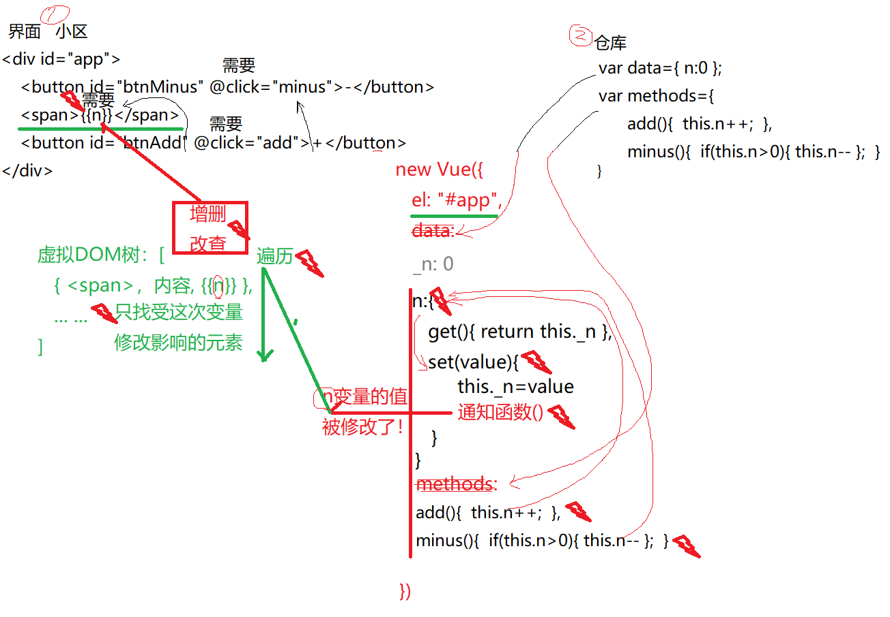

# Vue 笔记

## 一 什么是 Vue

1. 什么是: 是第三方开发的基于 MVVM 设计模式的渐进式的纯前端 JS 框架

   (1).. 第三方开发: 下载才能用
   (2). 基于 MVVM: ?
   (3). 渐进式: 可以在项目中逐步引入 vue 相关功能, 很容易和其他技术混搭.
   (4). 纯前端 JS: 不需要任何 nodejs 和后端的知识, 单靠浏览器就可以运行和学习 Vue.
   (5). 框架: 已经包含核心功能的半成品前端程序.

   

2. 为什么: 简洁! 避免大量重复的编码!

3. 何时: 今后只要以数据操作(增删改查)为主的项目, 都可以用 vue 开发.

## 二 如何使用 Vue

1. 2 种方式

    (1). 将 vue.js 下载到本地项目中引入网页中使用.

    > a. 官网: cn.vuejs.org
    > b. `<script src="js/vue.js">`
    > c. 问题:因为前端项目越来越大,文件夹结构和代码量越来越复杂,导致不同的团队和公司组织文件和文件夹结构时, 各不相同! --混乱

    (2). 公司中都是用 vue 脚手架代码开开发项目.

    a. 什么是: 已经包含标准的文件夹结构和核心功能的半成品项目!
    b. 优点: 标准! 不同团队和不同公司开发出的项目结构几乎是完全相同的!

2. 示例: 开始第一个 vue 小程序, 分别用 jQUery 和 Vue 实现点击修改数量功能

    (1). jQuery 版: 01-DOMdemo.html

        ```html
        <body>
            <button>-</button>
            <span>1</span>
            <button>+</button>

            <script src="https://apps.bdimg.com/libs/jquery/2.1.4/jquery.min.js"></script>
            <script>
                // DOM 4步
                // 1. 查找触发事件的元素
                // 本例中：查找2个按钮元素
                /*  let btnMinus = document.body.children[0];
                let btnAdd = document.body.children[2]; */
                let $btnMinus = $('body>button:nth-child(1)');
                let $btnAdd = $('body>button:nth-child(3)');

                // 2. 绑定事件处理函数
                $btnAdd.click(function () {
                    // 3. 查找要修改的元素
                    let $span = $('span');
                    // 4. 修改元素
                    // 获取$span的内容，转为整数
                    let n = parseInt($span.html());
                    // $span的内容+1
                    n++;
                    // 将修改后的内容放回$span中
                    $span.html(n);
                })

                $btnMinus.click(function () {
                    // 3. 查找要修改的元素
                    let $span = $('span');
                    // 4. 修改元素
                    // 获取$span的内容，转为整数
                    let n = parseInt($span.html());
                    // $span的内容+1
                    n--;
                    // 将修改后的内容放回$span中
                    $span.html(n);
                });

            </script>

        </body>
        ```
    (2). Vue版: 02-Vuedemo.html

    

        ```html
        <body>
            <div id="app">
                <button @click="minus">－</button>
                <span>{{n}}</span>
                <button @click="add">＋</button>
            </div>


            <script src="../common/js/vue.js"></script>
            <script>
                var vm = new Vue({
                    el: "#app",
                    data: {
                        n: 0
                    },
                    methods: {
                        add() {
                            this.n++;
                        },
                        minus() {
                            this.n--;
                        }
                    }
                })
            </script>
        </body>
        ```
3. 总结: Vue开发一个功能的基本步骤:3步

    (1). 定义界面:

    > a. 要求: 整个界面所有元素必须放在一个唯有的父元素下包裹
        习惯上: `<div id="app">...</div>`
    > b. 找到界面内将来可能发生变化的位置, 用 **{{自定义变量名}}** 临时占位
    > c. 找到界面中所触发事件的元素, 用 **@事件名="自定义处理函数名"** 标记

    (2). 定义仓库对象: 2个 (data和methods)

    > a. data: 专门保存界面中所需的所有变量及其初始值
    > b. methods: 专门保存界面中所需的所有事件处理函数
        因为将来data对象和methods对象会被new Vue()合并为一个对象，所以methods中的事件处理函数，和data中的变量最终会保存在同一个对象中。所以，methods中的事件处理函数可以通过this.变量名操作data中的变量.

    (3). 创建Vue对象, 充当快递员:

        ```js
        new Vue({
            el:"#app", //选择器: 告诉vue对象要将变量和函数送到页面中哪个大块区域中的元素上。
            //告诉vue对象界面所需的一切变量和函数都保存在哪里——仓库位置
            data, //data:data, 
            methods, //methods:methods,
        })
        ```

4. 简写: 因为data对象和methods对象迟早都要被装进new Vue()对象中，所以实际开发中，我们不单独定义data和methods对象。而是直接在new Vue()中data属性和methods属性值对象中直接添加页面所需变量和事件处理函数:

        ```js
        new Vue({
            el:"#app", //选择器: 告诉vue对象要将变量和函数送到页面中哪个大块区域中的元素上。
            //告诉vue对象界面所需的一切变量和函数都保存在哪里——仓库位置
            data:{
                变量:初始值,
                    ... : ...
            },
            methods:{
                处理函数名(){
                    this.变量
                },
                ...
            }
        })
        ```

5. 简写后的步骤: 3步

    (1). 定义界面
    (2). 先定义new Vue()对象, 用选择器找到自己负责的页面区域
    (3). 在new Vue()对象内, 添加data属性和methods属性, 其值都是对象.
    > a. data属性对象中专门保存页面所需的所有变量
    > b. methods属性对象中专门保存页面所需的所有函数

    

6. 结果: 无论任何原因, 只要data中的变量值发生变化, new Vue()快递员都会 *自动* 将新值 *重新送货* 到界面中对应的元素上. new Vue()会始终保持界面显示的内容和data中变量值同步!

## 三 MVVM 设计模式

1. 对前端代码的重新划分

2. 为什么：

    (1). 旧的前端代码分为三部分：

    > a. HTML：仅包含网页内容的静态代码
    > b. CSS：仅包含网页样式的静态代码
    > c. JS：负责一切网页内容、属性和样式的变化

    (2). 问题：

    > a. HTML和CSS缺少程序必要的要素：没有变量、分支、循环，HTML和CSS几乎生活不能自理！任何一点变化，都需要靠JS来完成
    > b. JS要负责HTML和CSS中几乎所有变化，导致大量重复代码和繁琐的步骤！

3. **MVVM** 如何重新划分前端代码: 依然三部分

    (1). 界面(View): 增强版的 HTML+CSS

    > a. 给HTML添加了变量的功能: `<span>{{n}}</span>` 如果n变化, 则span自动变化, 无需任何JS 代码.
    > b. 为HTML添加了分之和循环功能: **v-if, v-else以及v-for**

    (2). 模型(Module): 专门集中保存页面所需的变量和函数的对象

    > 比如:data和methods都是模型对象
    > 问题: 模型对象中的变量和方法不会自己张腿跑到界面中的元素上.

    (3). 视图模型(ViewModel): 快递员
    > a. 什么是视图模型: 自动将data中的变量和methods中的函数送到界面中指定元素上，并能自动保持界面显示与data中变量值同步的一种特殊的对象.
    > b. 比如: new Vue()就充当了视图模型自动配送的角色.

4. Vue 框架如何实现 MVVM 设计模式的：Vue 的绑定原理

    (1). 引入 vue.js 时，其实是引入了一种类型 Vue

    (2). 如果向使用 vue 框架做开发, 必须都要常见 new Vue() 对象

    (3). new Vue()刚创建时, 先把模型对象的 data 和 methods 中的数据引入到 new Vue()对象中.

    > a. 先将data中的原变量隐性埋名, 半隐藏, 再自动给data中每个变量请访问器属性(保镖)冒名顶替. 结果: 今后, 在任何位置只要使用变量, 其实使用的都是访问器属性,已经不可能直接用原变量了.
    > b. 在每个变量的访问器属性中的set函数中,都内置了一个通知函数.
    > c. 结果: 将来只要试图修改访问器属性表示的变量时,都会触发set中的通知,来通知整个框架,哪个变量被修改了.
    > d. 然后, new Vue()会将methods中的事件处理函数, 全部打散. 导致methods中的所有事件处理函数, 变成直接隶属于new Vue()对面的方法.

    (4). 当 new Vue()的 data, methods 和访问器属性都创建完毕后, new Vue()开始扫描 el 属性所指向的页面区域.

    > a. 扫描过程中, 只会将可能发生变化的元素保存在一个集合中. 这个仅保存可能变化的少量的元素的集合, 称为虚拟DOM树.
    > b. 首次扫描时, new Vue()会将data中的变量值首次自动更新到对应的元素上.
    > c. 今后new Vue()中任何一个变量一旦被修改, 都会自动触发set函数中的通知函数, 通知函数就会向虚拟DOM树发送通知.
    > d. 一旦虚拟DOM树接到某个变量发生变化的通知之后, 就会重新扫描"虚拟DOM树", 快速找到受本次变量变化影响的元素. 并用变量的新值, 自动更新元素的内容.

5. 总结: vue 的绑定原理: 访问器属性+虚拟 DOM 树

    (1). 访问器属性: get/set

    > a. 专门提供对一个普通属性的保护
    > b. 每个访问器属性都包含一对儿, get和set函数
        >>i. 当外界试图获取访问器属性的值时, 自动调用访问器属性中的get
        >>ii. 当外界试图修改访问器属性的值时, 自动调用访问器属性中的set

    (2). 虚拟DOM树

    > a. 什么是: vue通过扫描真实DOM树, 只提取出个别可能发生变化的元素, 组成的一个棵简化版的新的DOM树.
    > b. 虚拟DOM树在绑定过程中如何发挥作用:
        >> 1). new Vue中任何位置修改了data中的变量, 其实修改的都是访问器属性
        >> 2). 都会自动触发这个访问器属性的set, 都会自动发出通知
        >> 3). new Vue接到通知遍历虚拟DOM树, 只找受本次变量修改影响的个别DOM元素
        >> 4).虚拟DOM树利用已经封装好的增删改查操作, 仅更新页面上受影响的个别元素. 而不是大范围替换界面元素. --效率远高于jQuery!

    

    > c. 虚拟 DOM 树的优点:
        >> (1). 小: 只包含可能变化的元素
        >> (2). 快: 遍历查找快
        >> (3). 高: 修改效率高, 只修改受影响的元素. 不受影响的元素, 一点也不改.
        >> (4). 避: 避免重复的编码, 已经封装好了增删改操作, 程序员无需手动编写.

6. 总结: vue 功能的开发步骤分为 3 步:

    (1). 先创建增强版的界面.
    (2). 再创建 new Vue()对象, 其中 el: 指向 new Vue()要监控的区域.
    (3). 在 new VUe()对象内定义模型对象 data 和 methods.

    > a. 所有界面所需的变量都放在data中,
    > b. 所有界面所需的事件处理函数都放在methods中.
