# Vue 笔记

- [Vue 笔记](#vue-笔记)
  - [day01](#day01)
    - [一 什么是 Vue](#一-什么是-vue)
    - [二 如何使用 Vue](#二-如何使用-vue)
    - [三 MVVM 设计模式](#三-mvvm-设计模式)
  - [day02](#day02)
    - [this 复习](#this-复习)
    - [一 绑定语法](#一-绑定语法)
    - [二 指令: 13 种](#二-指令-13-种)
  - [day03](#day03)
    - [一 指令(续)](#一-指令续)
    - [二 双向绑定](#二-双向绑定)
    - [三 绑定样式: 2 种](#三-绑定样式-2-种)
    - [四 自定义指令](#四-自定义指令)
  - [day04](#day04)
    - [一 计算属性](#一-计算属性)
    - [二 过滤器](#二-过滤器)
    - [三 axios](#三-axios)
    - [四 生命周期](#四-生命周期)
    - [五 组件](#五-组件)
    - [六 组件化开发](#六-组件化开发)
  - [day05](#day05)
    - [一 SPA](#一-spa)
    - [二 脚手架](#二-脚手架)
    - [三 懒加载](#三-懒加载)

---

## day01

### 一 什么是 Vue

1. 什么是: 是第三方开发的基于 MVVM 设计模式的渐进式的纯前端 JS 框架

   - (1). 第三方开发: 下载才能用
   - (2). 基于 MVVM: ?
   - (3). 渐进式: 可以在项目中逐步引入 vue 相关功能, 很容易和其他技术混搭.
   - (4). 纯前端 JS: 不需要任何 nodejs 和后端的知识, 单靠浏览器就可以运行和学习 Vue.
   - (5). 框架: 已经包含核心功能的半成品前端程序.

   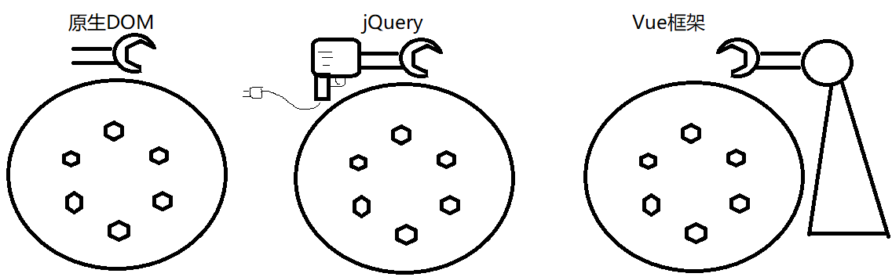

2. 为什么: 简洁! 避免大量重复的编码!

3. 何时: 今后只要以数据操作(增删改查)为主的项目, 都可以用 vue 开发.

### 二 如何使用 Vue

1. 2 种方式

   - (1). 将 vue.js 下载到本地项目中引入网页中使用.

      - a. 官网: cn.vuejs.org
      - b. `<script src="js/vue.js">`
      - c. 问题:因为前端项目越来越大,文件夹结构和代码量越来越复杂,导致不同的团队和公司组织文件和文件夹结构时, 各不相同! --混乱

   - (2). 公司中都是用 vue 脚手架代码开开发项目.
      - a. 什么是: 已经包含标准的文件夹结构和核心功能的半成品项目!
      - b. 优点: 标准! 不同团队和不同公司开发出的项目结构几乎是完全相同的!

2. 示例: 开始第一个 vue 小程序, 分别用 jQUery 和 Vue 实现点击修改数量功能.

   - (1). jQuery 版: 01-DOMdemo.html

      ```html
      <body>
         <button>-</button>
         <span>1</span>
         <button>+</button>

         <script src="https://apps.bdimg.com/libs/jquery/2.1.4/jquery.min.js"></script>
         <script>
         // DOM 4步
         // 1. 查找触发事件的元素
         // 本例中：查找2个按钮元素
         /*  let btnMinus = document.body.children[0];
               let btnAdd = document.body.children[2]; */
         let $btnMinus = $("body>button:nth-child(1)");
         let $btnAdd = $("body>button:nth-child(3)");

         // 2. 绑定事件处理函数
         $btnAdd.click(function () {
               // 3. 查找要修改的元素
               let $span = $("span");
               // 4. 修改元素
               // 获取$span的内容，转为整数
               let n = parseInt($span.html());
               // $span的内容+1
               n++;
               // 将修改后的内容放回$span中
               $span.html(n);
         });

         $btnMinus.click(function () {
               // 3. 查找要修改的元素
               let $span = $("span");
               // 4. 修改元素
               // 获取$span的内容，转为整数
               let n = parseInt($span.html());
               // $span的内容+1
               n--;
               // 将修改后的内容放回$span中
               $span.html(n);
         });
         </script>
      </body>
      ```

   - (2). Vue 版: 02-Vuedemo.html

     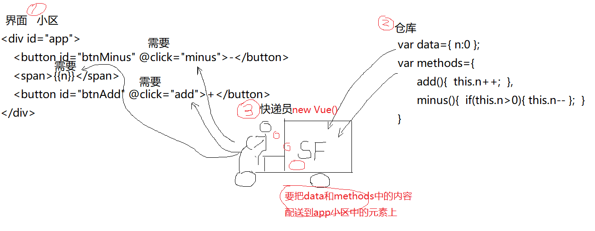

      ```html
      <body>
         <div id="app">
         <button @click="minus">－</button>
         <span>{{n}}</span>
         <button @click="add">＋</button>
         </div>
         <script src="../common/js/vue.js"></script>
         <script>
         var vm = new Vue({
               el: "#app",
               data: {
               n: 0,
               },
               methods: {
               add() {
                  this.n++;
               },
               minus() {
                  this.n--;
               },
               },
         });
         </script>
      </body>
      ```

3. 总结: Vue 开发一个功能的基本步骤:3 步

   - (1). 定义界面:

      - a. 要求: 整个界面所有元素必须放在一个唯有的父元素下包裹  
         习惯上: `<div id="app">...</div>`
      - b. 找到界面内将来可能发生变化的位置, 用 **{{自定义变量名}}** 临时占位
      - c. 找到界面中所触发事件的元素, 用 **@事件名="自定义处理函数名"** 标记

   - (2). 定义仓库对象: 2 个 (data 和 methods) 
      - a. data: 专门保存界面中所需的所有变量及其初始值.
      - b. methods: 专门保存界面中所需的所有事件处理函数.  
         因为将来 data 对象和 methods 对象会被 new Vue()合并为一个对象，所以 methods 中的事件处理函数，和 data 中的变量最终会保存在同一个对象中。所以，methods 中的事件处理函数可以通过 this.变量名操作 data 中的变量.

   - (3). 创建 Vue 对象, 充当快递员:

      ```js
      new Vue({
      el: "#app", //选择器: 告诉vue对象要将变量和函数送到页面中哪个大块区域中的元素上。
      //告诉vue对象界面所需的一切变量和函数都保存在哪里——仓库位置
      data, //data:data,
      methods, //methods:methods,
      });
      ```

4. 简写: 因为 data 对象和 methods 对象迟早都要被装进 new Vue()对象中，所以实际开发中，我们不单独定义 data 和 methods 对象。而是直接在 new Vue()中 data 属性和 methods 属性值对象中直接添加页面所需变量和事件处理函数:

   ```js
   new Vue({
      el:"#app", //选择器: 告诉vue对象要将变量和函数送到页面中哪个大块区域中的元素上。
      //告诉vue对象界面所需的一切变量和函数都保存在哪里——仓库位置
      data:{
         变量:初始值,
               ... : ...
      },
      methods:{
         处理函数名(){
               this.变量
         },
         ...
      }
   })
   ```

5. 简写后的步骤: 3 步

   - (1). 定义界面
   - (2). 先定义 new Vue()对象, 用选择器找到自己负责的页面区域
   - (3). 在 new Vue()对象内, 添加 data 属性和 methods 属性, 其值都是对象.
      - a. data 属性对象中专门保存页面所需的所有变量
      - b. methods 属性对象中专门保存页面所需的所有函数

   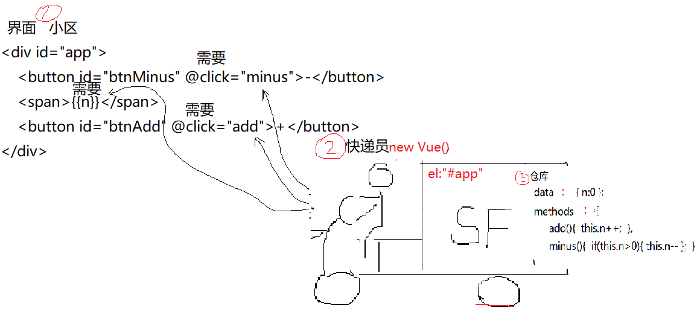

6. 结果: 无论任何原因, 只要 data 中的变量值发生变化, new Vue()快递员都会 _自动_ 将新值 _重新送货_ 到界面中对应的元素上. new Vue()会始终保持界面显示的内容和 data 中变量值同步!

### 三 MVVM 设计模式

1. 对前端代码的重新划分

2. 为什么：

   - (1). 旧的前端代码分为三部分：

      - a. HTML：仅包含网页内容的静态代码
      - b. CSS：仅包含网页样式的静态代码
      - c. JS：负责一切网页内容、属性和样式的变化

   - (2). 问题：
      - a. HTML 和 CSS 缺少程序必要的要素：没有变量、分支、循环，HTML 和 CSS 几乎生活不能自理！任何一点变化，都需要靠 JS 来完成
      - b. JS 要负责 HTML 和 CSS 中几乎所有变化，导致大量重复代码和繁琐的步骤!

3. *MVVM*如何重新划分前端代码: 依然三部分

   - (1). 界面(View): 增强版的 HTML+CSS

      - a. 给 HTML 添加了变量的功能: `<span>{{n}}</span>` 如果 n 变化, 则 span 自动变化, 无需任何 JS 代码.
      - b. 为 HTML 添加了分之和循环功能: **v-if, v-else 以及 v-for**

   - (2). 模型(Module): 专门集中保存页面所需的变量和函数的对象

      - 比如:data 和 methods 都是模型对象
      - 问题: 模型对象中的变量和方法不会自己张腿跑到界面中的元素上.

   - (3). 视图模型(ViewModel): 快递员
      - a. 什么是视图模型: 自动将 data 中的变量和 methods 中的函数送到界面中指定元素上，并能自动保持界面显示与 data 中变量值同步的一种特殊的对象.
      - b. 比如: new Vue()就充当了视图模型自动配送的角色.

4. Vue 框架如何实现 MVVM 设计模式的：Vue 的绑定原理

   - (1). 引入 vue.js 时，其实是引入了一种类型 Vue

   - (2). 如果向使用 vue 框架做开发, 必须都要创建 new Vue() 对象

   - (3). new Vue()刚创建时, 先把模型对象的 data 和 methods 中的数据引入到 new Vue()对象中.

      - a. 先将 data 中的原变量隐性埋名, 半隐藏, 再自动给 data 中每个变量请访问器属性(保镖)冒名顶替. 结果: 今后, 在任何位置只要使用变量, 其实使用的都是访问器属性,已经不可能直接用原变量了.
      - b. 在每个变量的访问器属性中的 set 函数中,都内置了一个通知函数.
      - c. 结果: 将来只要试图修改访问器属性表示的变量时,都会触发 set 中的通知,来通知整个框架,哪个变量被修改了.
      - d. 然后, new Vue()会将 methods 中的事件处理函数, 全部打散. 导致 methods 中的所有事件处理函数, 变成直接隶属于 new Vue()对面的方法.

   - (4). 当 new Vue()的 data, methods 和访问器属性都创建完毕后, new Vue()开始扫描 el 属性所指向的页面区域.
      - a. 扫描过程中, 只会将可能发生变化的元素保存在一个集合中. 这个仅保存可能变化的少量的元素的集合, 称为虚拟 DOM 树.
      - b. 首次扫描时, new Vue()会将 data 中的变量值首次自动更新到对应的元素上.
      - c. 今后 new Vue()中任何一个变量一旦被修改, 都会自动触发 set 函数中的通知函数, 通知函数就会向虚拟 DOM 树发送通知.
      - d. 一旦虚拟 DOM 树接到某个变量发生变化的通知之后, 就会重新扫描"虚拟 DOM 树", 快速找到受本次变量变化影响的元素. 并用变量的新值, 自动更新元素的内容.

5. 总结: vue 的绑定原理: 访问器属性+虚拟 DOM 树

   - (1). 访问器属性: get/set

      - a. 专门提供对一个普通属性的保护
      - b. 每个访问器属性都包含一对儿, get 和 set 函数
         - i. 当外界试图获取访问器属性的值时, 自动调用访问器属性中的 get
         - ii. 当外界试图修改访问器属性的值时, 自动调用访问器属性中的 set

   - (2). 虚拟 DOM 树

      - a. 什么是: vue 通过扫描真实 DOM 树, 只提取出个别可能发生变化的元素, 组成的一个棵简化版的新的 DOM 树.
      - b. 虚拟 DOM 树在绑定过程中如何发挥作用:
         - 1). new Vue 中任何位置修改了 data 中的变量, 其实修改的都是访问器属性
         - 2). 都会自动触发这个访问器属性的 set, 都会自动发出通知
         - 3). new Vue 接到通知遍历虚拟 DOM 树, 只找受本次变量修改影响的个别 DOM 元素
         - 4).虚拟 DOM 树利用已经封装好的增删改查操作, 仅更新页面上受影响的个别元素. 而不是大范围替换界面元素. --效率远高于 jQuery!

     

      - c. 虚拟 DOM 树的优点:
         - 1). 小: 只包含可能变化的元素
         - 2). 快: 遍历查找快
         - 3). 高: 修改效率高, 只修改受影响的元素. 不受影响的元素, 一点也不改.
         - 4). 避: 避免重复的编码, 已经封装好了增删改操作, 程序员无需手动编写.

6. 总结: vue 功能的开发步骤分为 3 步:

   - (1). 先创建增强版的界面.
   - (2). 再创建 new Vue()对象, 其中 el: 指向 new Vue()要监控的区域.
   - (3). 在 new VUe()对象内定义模型对象 data 和 methods.
      - a. 所有界面所需的变量都放在 data 中,
      - b. 所有界面所需的事件处理函数都放在 methods 中.

## day02

### this 复习

1. obj.fun(): this -> obj

2. fun() 或 (function(){...})()或 多数回调函数 或定时器函数: this -> window

3. new Fun(): this -> new 正在创建的新对象

4. 类型名.prototype 共有方法=function(){...}: this -> 将来谁调用就指向谁, 同第一种情况

5. 箭头函数中的 this -> 箭头函数外部作用域中的 this

6. DOM 或 jQuery 中事件处理函数中的 this -> 当前正在触发事件的 DOM 元素对象. 如果需要使用简化版函数, 必须 \$(this)

7. jQuery.fn.自定义函数=function(){...}: this -> 将来调用这个自定义函数的.前的 jQuery 子对象, 不再用\$(this).

8. new Vue()中 methods 中的函数: this -> 当前 new VUe()对象.

### 一 绑定语法

1. 问题:旧 DOM 和 jQuery 中, 程序中的变量虽然发生了变化, 但是界面不会自动更新, 必须依靠 js 手工将变量的新值更新到页面, 导致大量重复的增删改查操作!

2. 解决: Vue 中让 HTML 中也支持变量了, 做到程序中的变量变化, HTML 界面中的显示自动变化!

3. 什么是绑定语法: 让 HTML 中也支持变量的一种专门的语法格式.

4. 何时: 只要 HTML 中有的元素内容需要随变量自动变化时, 都要用绑定语法.

5. 如何: `<元素>xxxx{{自定义变量名}}xxxx</元素>`

6. 原理: 当 new Vue() **扫描** 页面时, 只要 **扫描到{{}}** 这种语法, 就会将{{}}中的 js **变量或表达式的值计算** 出来, 再 **替换{{}}** 的位置最终显示给用户.

7. {{}}中可以放什么, 不能放什么? 和 ES6 的模板字符串\${}规定是完全一样的!

   - (1). 可以放:变量, 运算, 三目, 有返回值的函数调用, 创建对象, 访问数组元素.

   - (2). 不能放: 程序结构(分支和循环), 也不能放没有返回值的函数调用!

### 二 指令: 13 种

1. 问题: {{}}只支持内容变化, 不支持样式和属性变化.

2. 解决: 指令.

3. 什么是: 指令是为 HTML 元素添加更多新功能的特殊属性.

4. 何时: 今后只要希望给 HTML 添加更多的新功能, 比如分支, 循环等, 都要用指令来实现.

5. 包括:

   - (1). v-bind [源码参考: 02-day/02-v-bind.html]

      - a. 什么是: 专门让属性值也能根据变量值自动变化
      - b. 何时: 今后只要希望属性值也能根据变量自动变化时, 都用 `v-bind`
      - c. 如何: `<元素 v-bind:属性名="变量或js表达式">`
      - d. 强调: 一旦使用了 v-bind, ""中就不要再加{{}}了! ""就承担了{{}}的作用!
      - e. v-bind 简写: `<元素 :属性名="变量或js表达式">`
      - f. 原理: 当 new Vue()扫描到`vbind:` 或 `:` 时会自动计算`""`中的变量或 js 表达式的值, 将计算后的新值, 作为该属性的属性值!
      - g. 示例: 根据 pm25 的数值显示不同的图片.

   - (2). v-show [源码参考: 02-day/03-v-show.html]
      - a. what 是什么: 专门根据一个条件控制一个元素的显示隐藏的指令
      - b. when 何时用, 场景: 今后只要控制一个元素显示隐藏, 都用 v-show
      - c. where 放哪里,何地: `<元素 v-show="bool变量或js条件表达式">`
      - d. why 原理: 当 new Vue()扫描到 v-show 时, 会自动计算""中变量或表达式的 bool 值.
         - 1). 如果计算结果为 true, 则什么也不做, 当前元素默认显示
         - 2). 如果计算结果为 false, 则自动给当前元素加 display: none, 隐藏当前元素.

   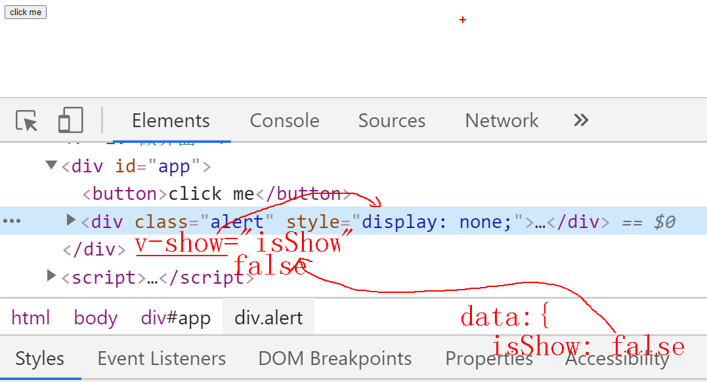
   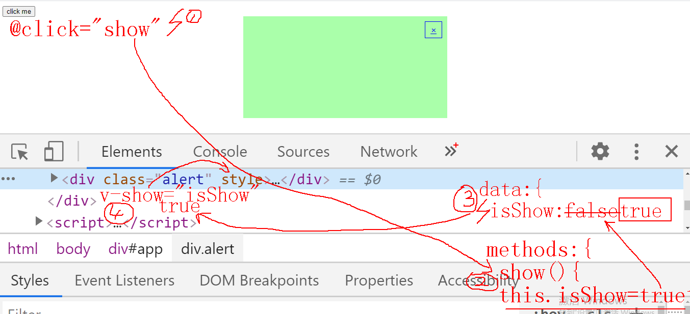
   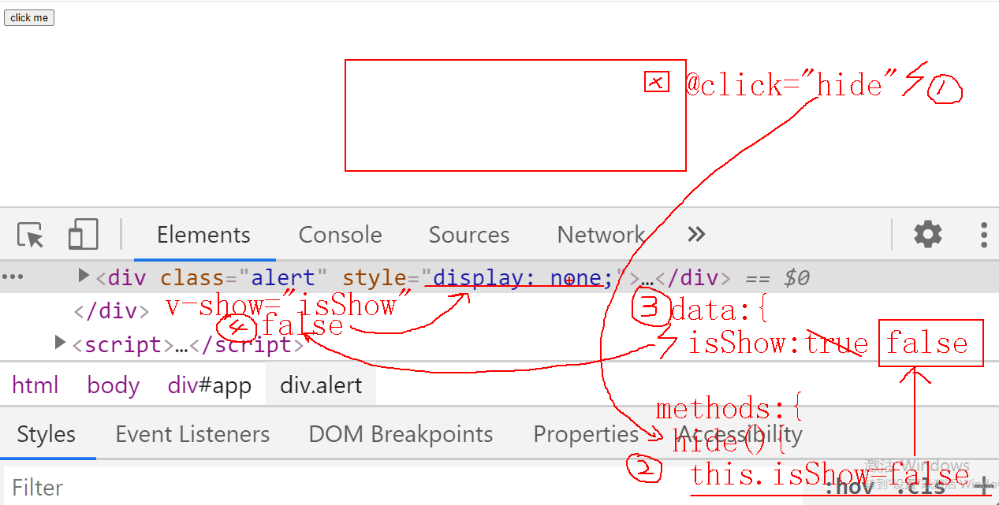

   - (3). v-if 和 v-else [源码参考: 02-day/04-v-if&v-else.html]

      - a. what: 专门根据一条见控制两个元素二选一显示.
      - b. when: 今后只要两个元素二选一显示时, 都用 v-if 和 v-else
      - c. where:

         ```html
         <元素1 v-if="bool变量或js条件表达"></元素1>
         <元素2 v-else></元素2>`
         <!--
               强调: v-if和v-else两个元素必须紧挨着写!中间不能插入任何其他内容!
         -->
         ```

      - d. why: new Vue()扫描到 v-if 和 v-else 这里时, 会自动计算变量值或条件表达式的结果.
         - 1). 如果 v-if 中的条件表达式计算结果为 true, 则保留 v-if 所在的元素, 删除 v-else 所在的元素.
         - 2). 如果 v-if 中的条件表达式计算结果为 false, 则删除 v-if 所在元素, 保留 v-else 所在元素.

   - (4). v-else-if [源码参考: 02-day/05-v-else-if.html]

      - a. what: 专门和 v-if 和 v-else 配合来空盒子多个元素多选一的显示
      - b. when: 只要多个元素多选一显示时
      - c. where:

         ```html
         <元素1 v-if></元素1>
         <元素2 v-else-if></元素2>
         <元素3 v-else></元素3>
         <!--
               强调: v-if  v-else-if  v-else的几个元素必须紧挨着写, 中间不能插入其他内容!
         -->
         ```

      - d. why:
         - 1). 当 new Vue()扫描到 v-if 时, 先计算 v-if 后的变量或条件表达式, 如果 v-if 后的条件为 true, 则保留 v-if 删除其它 v-else-if 和 v-else.
         - 2). 如果 v-if 的条件为 false, 则继续向后扫描每个 v-else-if. 只要任意一个 v-else-if 后的条件为 true, 则删除除该 v-else-if 之外的其余兄弟元素, 只显示当前 v-else-if 的元素.
         - 3). 如果所有 v-if 和 v-else-if 的条件都为 false, 则删除所有 v-if 和 v-else-if 的元素, 仅保留 v-else 所在元素显示.

   - (5). v-for [源码参考: 02-day/06-v-for.html]

      - a. what: 专门根据数组中的元素内容, 自动反复生成多个相同结构的带上内容不同的页面元素的列表的指令.
      - b. when: 只要在页面中反复生成多个相同的结构的元素组成的列表.
      - c. where: `<要反复生成的元素 v-for="(元素值, 下标) of 数组" :key="下标"></要反复生成的元素>`
      - d. why:
         - 1). 当 new Vue() 扫描到 v-for 时, 会自动遍历 of 后的数组.
         - 2). 每遍历数组中的一个元素值.
            - i. 就自动将当前元素值和当钱下标位置保存到 of 前的两个变量中(顺序不能变).
            - ii. 还会自动创建当前 v-for 所在的元素副本, 并用 of 前的两个变量内容, 填充新生成的相同结构的元素副本.

      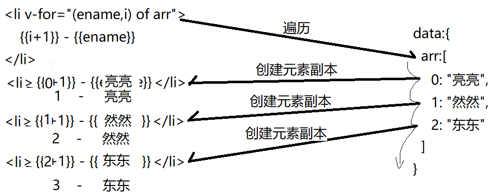

      - e. 问题: v-for 生成了多个相同结构的元素副本,除了内容不同之外, 元素本身毫无差别! 所以, 万一数组中某个位置的元素被删除一个, v-for 无法知道该精确的删除哪一个页面元素副本, v-for 只能采用一个很笨的办法, 删除有所有的副本, 重建整个列表! --效率极低!
      - f. 解决: 今后只要使用 v-for 反复生成多个相同结构的元素副本时, 都要为每个元素副本额外绑定一个专门的属性 :key="不重复的值", key 绑定的值要求必须是唯一的值, 不能重复.
      - g. 优点: 从此每个元素副本都有一个唯一的标识, 当数组中某个位置的元素被删除时, v-for 只要根据下标找到对应 key 值的一个元素对象, 删掉即可, 其余元素不受影响——效率高!

      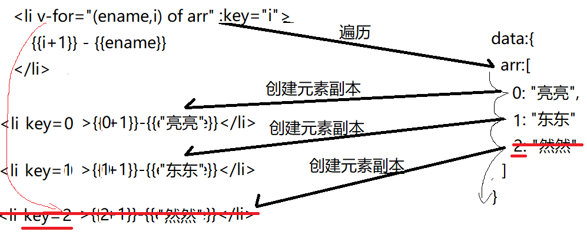

     **高频笔试题**: v-for 为什么必须绑定 `:key` ?

     答: 如果不绑定:key, 则每删除数组中一个元素, v-for 都会删除所有元素副本, 重建整个列表——修改效率低. 绑定:key 是给每个元素副本添加一个唯一的标识, 在删除数组元素时, 可根据唯一标识找到对应的一个元素对象, 删除即可, 其它元素不受影响——修改效率高!

      - h. 其实, v-for 不但可以遍历数字下标的数组, 还可以遍历自定义下标名称的对象或关联数组.

      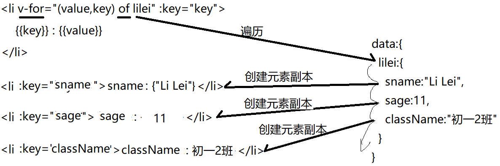

      - i. 案例: 遍历对象中每个属性, 在页面创建属性列表

         ```html
         <!DOCTYPE html>
         <html lang="en">
               <head>
               <meta charset="UTF-8" />
               <meta
                  name="viewport"
                  content="width=device-width, initial-scale=1.0"
               />
               <title>Document</title>
               <script src="js/vue.js"></script>
               </head>
               <body>
               <!--1. 做界面-->
               <div id="app">
                  <!--想显示一个学生对象的个人信息
               用v-for去遍历lilei对象中每属性
               自定义的key变量，接住正在遍历的属性的属性名
               自定义的value变量，接住正在遍历的属性的属性值
               因为对象中，属性名一定是不重复的！所以:key应该绑定不重复的属性名-->
                  <ul>
                  <li v-for="(value,key) of lilei" :key="key">
                     {{key}} : {{value}}
                  </li>
                  </ul>
               </div>
               <script>
                  //2. 创建new Vue()对象，监视id为app的区域
                  new Vue({
                  el: "#app", //3. 创建模型对象，保存页面所需的所有变量
                  data: {
                     lilei: {
                     sname: "Li Lei",
                     sage: 11,
                     className: "初一2班",
                     },
                  },
                  });
               </script>
               </body>
         </html>
         ```

      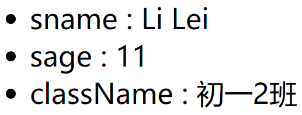

      - j. 其实: v-for 还会数数, v-for 可根据给定的一个数字, 从 1 开始依次生成指定数量的元素副本.  
         <元素 v-for="i of 整数">

      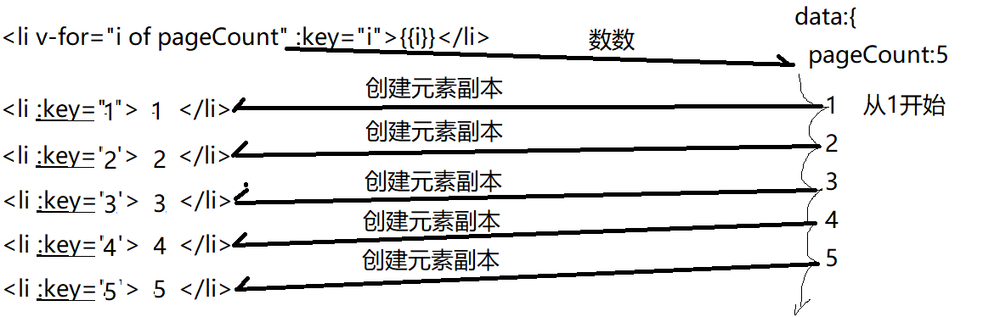

      - k. 案例: 使用 v-for 生成一组分页按钮

         ```html
         <!DOCTYPE html>
         <html lang="en">
               <head>
               <meta charset="UTF-8" />
               <meta
                  name="viewport"
                  content="width=device-width, initial-scale=1.0"
               />
               <title>Document</title>
               <script src="js/vue.js"></script>
               <style>
                  ul{ list-style:none; }
                  ul>li{
                    float:left;
                    padding: 5px 10px;
                    border:1px solid #aaa
                  }
                  ul>li~li{
                    border-left:0;
                  }
               </style>
               </head>
               <body>
               <!--1. 做界面-->
               <div id="app">
                  <!--想生成一组分页按钮，根据程序中总页数(pageCount)变量值动态生成指定数量的分页按钮-->
                  <ul>
                  <li v-for="i of pageCount" :key="i">{{i}}</li>
                  </ul>
               </div>
               <script>
                  //2. 创建new Vue()对象监控id为app的区域
                  new Vue({
                  el: "#app", //3. 创建模型对象，保存界面所需的所有变量
                  data: {
                     pageCount: 5,
                  },
                  });
               </script>
               </body>
         </html>
         ```

   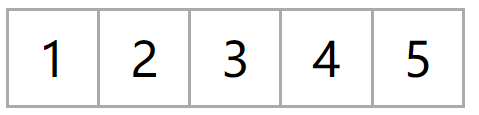

   - (6). v-on

      - a. what: 专门为元素绑定事件处理函数的指令
      - b. when: 今后只要为元素绑定事件处理函数都用 v-on
      - c. where:
         - 1). HTML 中: <元素 v-on:事件名="处理函数(实参值, ...)">
         - 2). new Vue()中 methods 中: 处理函数(形参变量, ...){...}
      - d. 简写: <元素 @事件名="处理函数">
         - 1). v-on: 可用@代替
         - 2). 如果事件处理函数不需要传入实参值, 则()可省略!
      - e. 需求 1: 希望触发事件处理函数时可以传入实参

         - 1). where:

         ```html
         <元素 @事件名="处理函数(实参值, ...)">

         methods: {
            处理函数(形参变量,...) {
               ...
               }
         }
         ```

         - 2). 案例: 点哪个 div, 就喊哪个 div 疼!

         ```html
         <!DOCTYPE html>
         <html lang="en">
         <head>
               <meta charset="UTF-8" />
               <meta
               name="viewport"
               content="width=device-width, initial-scale=1.0"
               />
               <title>Document</title>
               <script src="js/vue.js"></script>
               <style>
               #d1,
               #d2 {
                    width: 400px;
                    height: 300px;
               }
               #d1 {
                    background-color: #afa;
               }
               #d2 {
                    background-color: #aaf;
               }
               </style>
         </head>
         <body>
               <!--1. 做界面-->
               <div id="app">
               <!--需求1: 两个div，点哪个div，就让哪个div喊疼!
                   所以在绑定事件处理函数时，将每个div的名字字符串，提前放入事件处理函数的实参中！-->
               <div id="d1" @click="say('亮亮')">成亮</div>
               <div id="d2" @click="say('然然')">李然</div>
               </div>
               <script>
               //2. 创建new Vue()对象，监视id为app的区域
               new Vue({
                  el: "#app", //3. 创建模型对象，保存页面所需的变量和事件处理函数 //没有变量，所以不用写data //但是有事件处理函数
                  methods: {
                  //因为事件绑定时会传入一个实参值，所以定义事件处理函数时，需要定义一个形参变量，准备接将来传入的实参值。
                  say(ename) {
                     console.log(`${ename} 疼!`);
                  },
                  },
               });
               </script>
         </body>
         </html>
         ```

      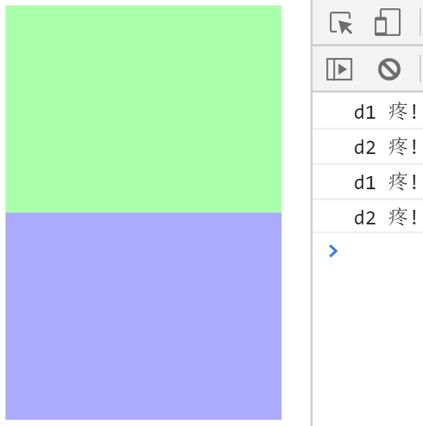

      - f. 需求 2: 希望事件发生时, 获得事件对象 --同 DOM

         - 1).where:

         ```html
         <元素 @事件名="事件处理函数">

         // 强调: 只获得事件对象e时, 不要加()
         //一旦HTML中加入(), 就不再自动传入事件对象e了
         methods: { // event
               事件处理函数(e) {
                  ...
               }
         }
         ```

         - 2). 案例: 点 div 哪个位置, 就哪个位置疼
         [源码参考: 02-day/08-v-on-event.html]

      - g. 需求 3: 笔试题: 如何既传入自定义实参值, 又获取事件对象

         - 1). 错误做法:

         ```js
         <@事件名="处理函数(是残值, ...)"> // 只要HTML中写(),
         methods: {
               处理函数(e) // 事件发生时就不会自定传入event了
         }
         ```

         - 2). 正确做法:

         ```js
         <元素 @事件名="处理函数(实参值, $event, ...)">
               methods: {
                  处理函数(型参变量, e, ...){... }
               }
         ```

         其中, $event是vue框架内置的一个关键字(不能改名), 先于事件处理函数获得event对象, 包装起来备用. 在HTML中传入$event 时, 和其他实参没有必然的顺序要求!

         - 3). 案例: 点哪个 div 的哪个位置, 就喊哪个 div 的哪个位置疼
            [源码参考: 02-day/09-v-on-$event.html]

   - (7). 防止用户短暂看到{{}}

      - a. 问题: 当网速慢的时候, new Vue()所在的 js 文件, 可能下载延迟, 就会让用户短暂看到 HTML 中的{{}}语法.
      - b. 解决: 2 种:

         - 1). v-clock 指令: //幕布\隐身斗篷

            - i. what: 专门在 new Vue()下载完成钱暂时用于隐藏元素的特殊指令.
            - ii. when: 今后所有用{{}}绑定的位置, 为了防止用户短暂看到{{}}语法, 都用该用 v-clock 暂时隐藏.
            - iii. where: 2 步:

               - a). 先在网页的 style 中用属性选择器为所有 v-cloak 的元素添加 display:none 属性

               ```css
               /*选择所有带有v-clock属性的元素*/
               [v-clock] {
               display: none;
               }
               ```

               - b). 再为要临时隐藏的元素添加 v-clock 属性.

            - iv. wyh:
               - a). 在 new Vue()加载出来之前，[v-cloak]{display:none}发挥作用, 找到所有带有 v-cloak 指令的元素, 让他们暂时隐藏.
               - b). 在 new Vue()加载出来之后, new Vue()会自动找到所有 v-cloak 属性, 并删除他们. 结果: 原来由于 v-cloak 属性而隐藏的元素, 才显示出来!
            - v. 问题: 被迫不但要写 HTML 和 JS, 还要记得去写 CSS, 繁琐.

         - 2). v-text
            - i. what: 专门代替{{}}语法来绑定元素内容的特殊指令.
            - ii. when: 其实为了避免用户短暂看到{{}}语法, 也可以用 v-text 来解决.
            - iii. where: `<元素 v-text="变量或js表达式"></元素>`
            - iv. why:  
               {{}}有可能导致用户短暂看到{{}}语法. 如果不使用{{}}, 而改为使用元素开始标签中的 v-text 属性. 则就算属性值没有加载出来, 用户也不可能看到元素开始标签中的属性
               当 new Vue()扫描到 v-text 时, 会先计算""中的变量值或表达式结果, 然后用变量值或表达式的结果, 覆盖元素开始标签到结束标签之间的内容.
            - v. 问题: 如果元素的内容需要写死的部分字符串和动态生成的部分字符串拼接而成!
               解决: 那么, 就不得不用模板字符串! 而不用 {{}}.  
               <元素 v-text=" \`xxx\${变量或计算表达式}\`">
            - vi. 问题: ""里在套用反引号, 写法太繁琐!
               解决: 其实有简写: 外围的""可省略, 只写反引号``即可.  
               <元素 v-text=\`xxx\${变量或计算表达式}\`>
            - vii. 问题: 在元素的属性中使用模板字符串拼接, 可读性差.

      - c. 以上两种情况有问题: 根据个人喜好用哪个都行
      - d. 案例: 分别使用 v-clock 和 v-text 防止用户短暂看到{{}}
         [源码参考: 02-day/10-v-clock.html][源码参考: 02-day/11-v-text.html]

## day03

### 一 指令(续)

1. v-html

   - (1). what: 专门绑定 HTML 代码片段内容.
   - (2). 问题: {{}}和 v-text 在绑定元素内容时, 即使要绑定的值是 HTML 片段, 也不会交给浏览器解析, 而是尽量保持原样显示. --类似于 DOM 中的 textContent 的特点.
   - (3). when: 今后只要绑定的内容是一段 HTML 片段时, 都用 v-html 代替 v-text 和{{}}.
   - (4). where: `<元素 v-html="xxx"></元素>`
   - (5). why: v-html 绑定的 HTML 片段内容会先交给浏览器解析后, 再显示到页面上给人看.
   - (6). 案例: 使用 v-html 绑定一段 HTML 代码片段:[源码参考: 03-day/01-v-html.html]

2. v-once

   - (1). what: 只在首次加载时, 绑定一次. 之后即使变量发生变化, 也不自动更新界面.
   - (2). 问题: 每次程序中变量更新时, vue 都会重新扫描虚拟 DOM 树. 虚拟 DOM 树中保存的元素越多, 扫描一遍用时越长. 虚拟 DOM 树中保存的元素越少, 扫描一遍用时越短.
   - (3). 优化: 如果一个元素的内容只需要在首次加载时动态显示, 在之后的操作过程中不会发生变化, 就应该用 v-once 标记.
   - (4). wyh: v-once 标记的元素, 只在首次加载页面时动态加载内容. 因为之后不再需要动态更新, 所以并不会加入到虚拟 DOM 树中的元素个数.
   - (5). when: 只有一个值确实只在首次动态加载, 之后不再发生变化时, 才用 v-once.
   - (6). 案例: 绑定用户上线时间和当前系统时间. [源码参考: 03-day/02-v-once.html]

3. v-pre
   - (1). what: 可以保持元素内容中的{{}}不被 vue 编译的特殊指令.
   - (2). when: 只要刚想在元素的正文中包含{{}}, 但是又不想被 vue 编译, 就用 v-pre 保护.
   - (3). 案例: 使用 v-pre 保护内容中{{}}不被 vue 编译. [源码参考: 03-day/03-v-pre.html]

### 二 双向绑定

1. 问题: 使用`:value="变量名"`, 无法将页面上用户输入的新内容,自动更新回程序 new Vue()对象的变量中.

2. 原因: 之前的绑定语法以及 12 中指令,都是**单向绑定**:

   - (1). 只能将程序中变量的修改自动更新到界面上显示 **(只能 Model ->View)**.
   - (2). 无法将界面上的修改后反向更新回程序的变量中 **(不能 View -> Model)**.

3. 解决: 今后只要希望动态获得界面上用户修改的新值, 都要用双向绑定:

   - (1). 既能将程序中变量的修改自动更新到界面上显示 **(既能 Model -> View)**.
   - (2). 又能将界面上的修改反向更新会程序的变量中 **(又能 View -> Model)**.

4. when: 只有绑定表单元素时, 才需要用到双向绑定. 因为只有表单元素的值, 用户才能修改. 除表单元素之外的其他普通元素(div, h3, p...), 都不需要双向绑定. 因为这些元素用户也改不了.

5. where: `<表单元素 v-model:value="变量名">`

6. 案例:点按钮, 获得文本框中输入的内容, 执行查找操作. [源码参考: 03-day/04-v-model.html]

7. wyh: 当 new Vue()扫描到带有 v-model 的元素, 都会自动给当前元素绑定 DOM 中的@input 或@change 事件. 只要用户输入或修改了表单元素的值, 都会自动触发事件. 在事件处理函数中, 提前保存了修改对应变量的语句.

   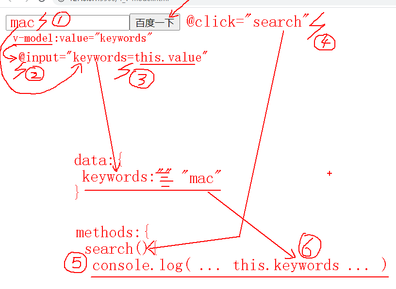

8. 案例: 使用`@input`事件模拟实现 v-model [源码参考: 03-day/05-v-model&oninput.html]

9. 不同类型的表单元素, v-model 绑定原理不同:

   - (1). 文本框(input type="text")和文本域(textarea)
      - a. 特点:用户输入新内容, 新内容自动保存到当前元素的 value 属性中.
      - b. 都可以: v-model:value = "变量名".
   - (2). 单选按钮(input type="radio")

      - a. 特点:
         - 1). value 属性值是写死的备选值, 用户切换选项时, 每个选项的 value 值保持不变! 所以, 不能用`v-model:value`.
         - 2). 当用户切换选项时, 其实改变的是 radio 元素的 checked 属性值, 也就是选中状态. 所以 v-model:checked="变量名".
      - b. where: `<input type="radio" name="分组名" value="写死的备选值" v-model:checked="变量名">`.
      - c. wyh:

         - 1). 首次加载时: 当 new Vue()扫描到 input type="radio"中的 v-model 时, 会用变量名和当前 radio 元素的 value 值做比较!

            - i. 如果 v-model 绑定的变量值等于 value 属性值, 则当前 radio 就选中.
            - ii. 如果 v-model 绑定的变量值不等于 value 属性值, 则当前 radio 就不选中.

            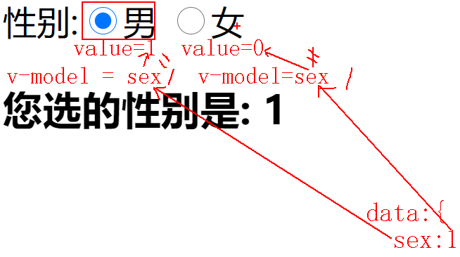

         - 2).当选中项发生改变时: v-model 会自动触发 onchange 事件, 将当前选中的元素 value 值自动更新回程序中 data 中的变量上.

            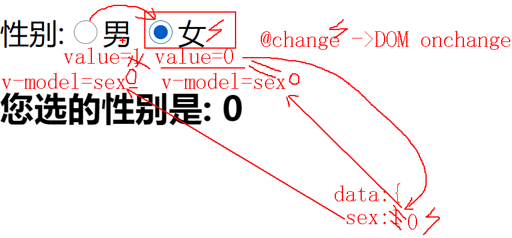

      - d. 案例: 性别选择. [源码参考: 03-day/06-v-model_radio.html]

   - (3). select 元素

      - a. 特点:
         - 1). 每个选项的 value 值不是写在 select 元素上, 而是写在 select 下的每个 option 元素上, 且这些 option 的 value 也都是写死的固定不变的备选值.
         - 2). 当选中 select 下某一个 option 时, 这个 option 的 value, 会成为整个 select 元素的 value.
      - b. where: 所以, 应该用 v-model 绑定 select 元素的 value 属性.

         ```html
         <select v-model:value="变量名">
               <option value="备选值">
               ...
               </option></select
         >
         ```

      - c. wyh:

         - 1). 当首次加载页面时: v-model 会用绑定的变量值和每个 option 中的备选值 value 做比较. 哪个 option 的 value 值与变量的值相同, 就选中哪个 option.

            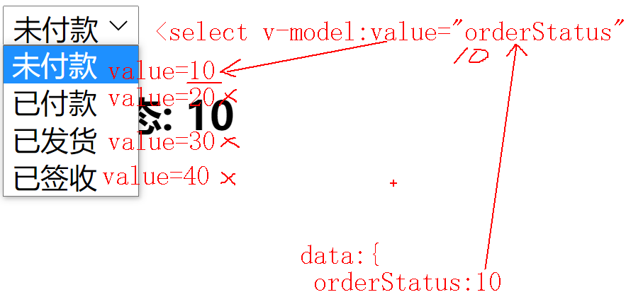

         - 2). 当选项发生改变时: v-model 会获得当前选中的 option 的 value 值, 自动更新回 v-model 绑定的变量中.

            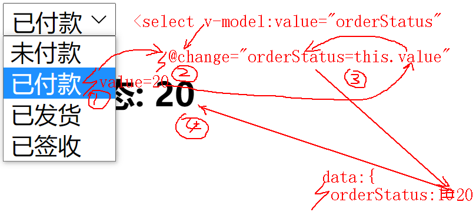

      - d. 案例: 选择订单状态. [源码参考: 03-day/07-v-model_select.html]

   - (4). checkbox: 只讨论单独使用的情况

      - a. 特点: 用户选中与不选中 checkbox 改变的不是 value 属性, 而是 checked 属性, 且 checked 属性的值是 boolean 类型.
      - b. where: `<input type="checkbox" v-model:checked="boolean类型变量"`
      - c. wyh:

         - 1). 首次加载时:
            - i. 如果 v-model 绑定的变量值为 true, 则当前 checkbox 选中.
            - ii. 如果 v-model 绑定的变量值为 false, 则当前 checkbox 不选中.
         - 2). 在修改 checkbox 选中状态时: v-model 会将 checkbok 最新的 checked 属性值, 也就是 checkbox 的选中状态, 自动更新回程序中的变量上, 且值也是 boolean 类型.

         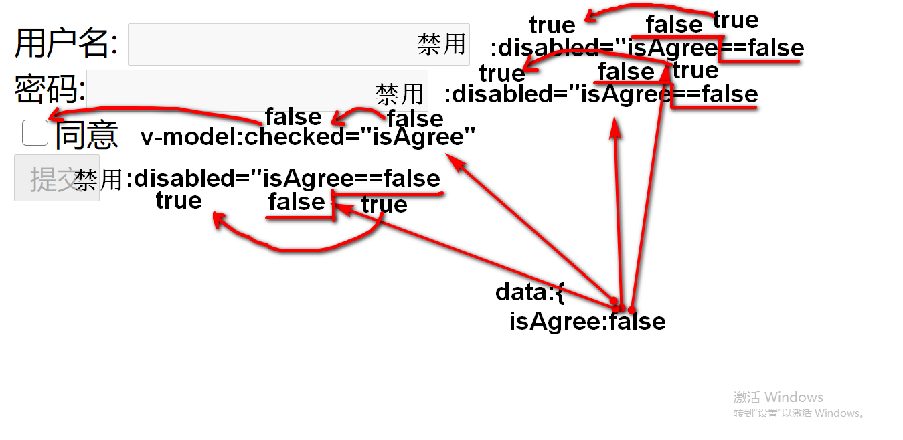
         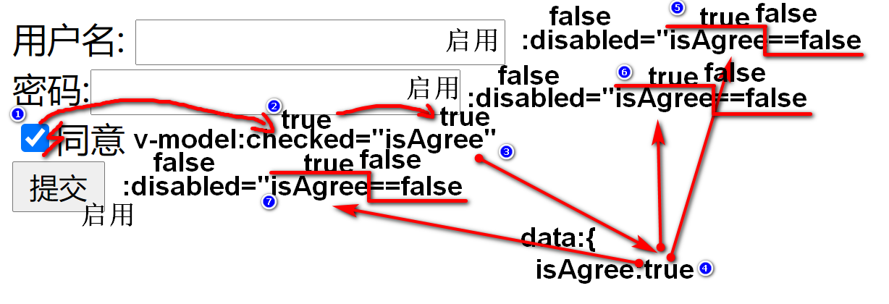

      - d. 案例: 点同意, 启用其他表单元素; 不同意, 禁用其他表单元素. [源码参考: 03-day/08-v-model_checkbok.html]

10. 简写: 其实以上所有 v-model 后的"`:属性名`"都可省略, v-model 会自动根据自己所在的表单元素不同, 自动判断该绑定哪个属性, 所以, 今后只要希望修改表单元素, 同时自动修改程序中的变量时, 只用 v-model 即可!

### 三 绑定样式: 2 种

1. 如果内联样式(style)需要根据程序中的变量自动变化.

   - (1). 不好: 将 style 属性作为一个普通的字符串类型的属性来绑定

      - a. where:

         ```html
         <元素 :style="变量名"> data: { 变量名: "css属性:值; css属性:值; ..." }
         ```

      - b. 缺点: 极其不便于修改其中一个长 css 属性值.

   - (2). 好的: vue 中的 style 支持以对象语法绑定样式

      - a. 使用匿名对象的方式: **js 语法格式**

         - 1). where:

         ```html
         <元素 :style="{css属性名:变量名, ...}"> data: { 变量名: 值, ...: ... }
         ```

         - 2). why: 运行时,new Vue()先用 data 中的变量值替换 style 对象中的属性后的变量名, 最后将 style 后的对象, 翻译成 style 字符串语法.
         - 3). 问题: 如果多个变量都需要修改 style 中的内联样式, 正巧都需要修改同一种 css 属性值, 很可能发生变量冲突.
         - 4). 解决: 用有名称的对象方式.

      - b. 简写: 当 css 属性名与变量名字相同时, 简写为

         ```html
         <元素 :style="{css属性名1, css属性名2, ...}">

         data: {
               css属性名1: 值,
               css属性名2: 值,
               ...: ...
         }
         ```

      - c. 使用有名称对象的方式:

         - 1). where:

            ```html
            <元素 :style="变量名">

            // 再替换界面中: style的位置
            data: {
                  变量名: {
                  // 运行时，会先将变量名后的对象内容编译为style字符串 css属性名1: 值,
                  css属性名2: 值,
                  ...: ...
                  }
            }
            ```

         - 2). 好处: 能够避免多个元素之间要修改的 style 变量发生冲突.

   - (3). 问题: 如果有些内联样式是固定不变的, 而另一些内样样式是动态变化的.

   - (4). 其实,一个元素上不带`:`的写死的 style, 可以和带`:`动态变化的 style 并存! 最后在运行时, `style`和`:style`会合并为一个 style!

      ```html
      <元素 style="固定不变的样式" :style="对象(包含变化的css属性)"></元素>
      ```

   - (5). 案例: 使用内联样式控制方块上下左右移动. [源码参考: 03-day/09-v-bind_style.html]

      - a. 用匿名对象方式绑定
      - b. 用有名称的对象方式绑定

   - (6). 问题: 网页中很多效果需要同时修改多个 css 属性, 如果用 style 一个属性一个属性去修改, 代码会很繁琐.

   - (7). 总结:
      - a. 如果确实需要精确修改某一个 css 属性值时才用 style.
      - b. 如果需要批量修改一个元素的多个 css 属性值时最好采用 class

2. 如果用 class 需要根据程序中的变量自动变化

   - (1). 不好的做法: 将整个 class 字符串看做一个变量来绑定.

   - (2). 问题: 极其不便于只修改其中一个 class!

   - (3). 好的做法: 用对象语法: 2 种

      - a. 为每个 class 都分别指定一个变量:

         - 1). where:

        ```html
        <元素 :class="{class名1:变量名1, class名2:变量名2, ...}"></元素>

        data: {
            变量名1: 必须boolean值true或false
            变量名2: 必须boolean值true或false
            ...: ...
        }
        ```

         - 2). 强调: 绑定语法中 class 后的变量值, 必须是 boolean 类型的 true 或 false.
            - i. 如果值为 true, 则启用该 class
            - ii. 如果值为 false, 则禁用该 class
         - 3). 问题: 如果多个元素都需要用 success 和 fail 作为验证结果的 class 名, 则变量之间一定会产生冲突.
         - 4). 解决: 将一个元素用在所有 class 集中保存在一个变量内.

      - b. 为整个 class 属性只指定一个统一的变量.

         - 1). where:

            ```html
            <元素 :class="变量名"></元素>

            data: {
                  变量名: {
                     class名1: true,
                     class名2: false,
                     ...: ...
                  }
            }
                  ```

         - 2).好处: 避免多个元素使用相同 class 名时发生变量冲突.

   - (4). 问题: 如果一个元素上有些 class 是不变的, 有些 class 是动态变化的, 怎么办?

   - (5). 其实: class 也支持不带`:`写死的 class 与带`:`动态绑定的 class 在一个元素中混搭. 最终运行时,`class`与`:class`会合并为一个 class.

      ```html
      <元素 class="固定不变的class" :class="动态变化的class">
      ```

   - (6). 案例: 使用 class 实现手机号格式验证.

      - a. 为每个 class 分别起一个变量名, 该变量名类型为 boolean
         [源码参考: 03-day/10-v-bind_class.html]
      - b. 为一个元素的整个 class 属性只起一个变量名, 该变量名类型为 boolean
         [源码参考: 03-day/11-v-bind_class.html]

         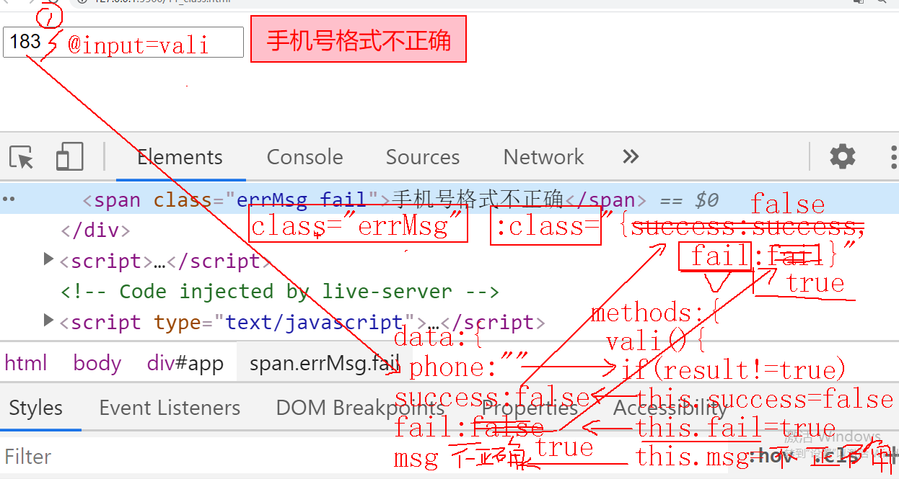
         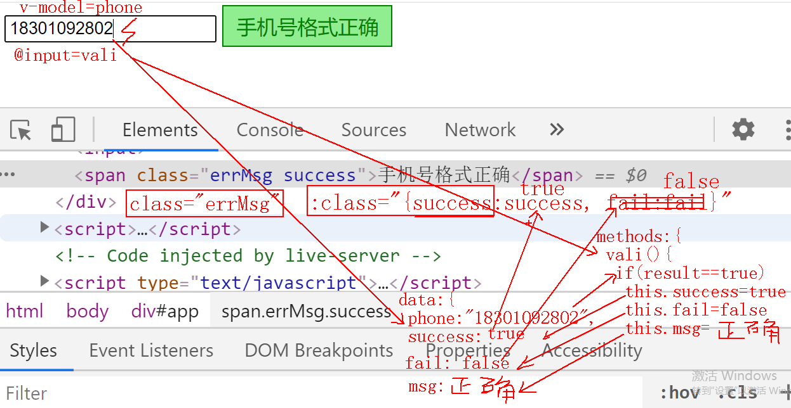

### 四 自定义指令

1. 如果 vue 官方提供的 13 种指令不够用, 也可以自己添加自定义指令.

2. when: 如果希望在首次加载时对一个元素执行一些默认的 DOM 操作.

3. 如何向 vue 中添加自定义指令:

    ```js
    // 给vue大家庭中添加一个新的自定义指令
    Vue.directive("指令名", {
        // 希望凡是带有这个指令的元素, 在被加载到页面时能自动执行一个操作, 就会自动调用inserted函数.
        inserted(domElem) {
        //回调函数
        // 放在inserted中的代码, 注定会在元素被加载到页面之后自动执行
        // 形参变量domElem, 自动接受当前带有自定义执行的DOM元素对象
        // 就可以对当前带有自定义指令的元素, 名正言顺的执行DOM操作
        },
    });

    // 强调: 定义自定义指令时, 指令名前不要加v-前缀! 而在页面标签元素中引用加"v-"前缀!
    ```

4. 如何使用自定义指令:

   `<元素 v-自定义指令名`

   强调:在使用自定义指令时, 必须加上**v-**前缀

5. 结果:

   - (1). 当 new VUe()扫描到带有 v-自定义指令的元素后, 就会去 vue 大家庭中找是否包含该名称的自定义指令.

   - (2). 只要找到当前名称对应的指令, 就自动调用指令对象内的 inserted 函数, 并自动传入当前 DOM 元素对象作为实参值.

   - (3). 在 inserted 回调函数内可以对当前 DOM 元素执行 DOM 操作.

6. 案例: 页面加载时, 让一个元素自动获取焦点. [源码参考: 03-day/12-v-directive.html]

   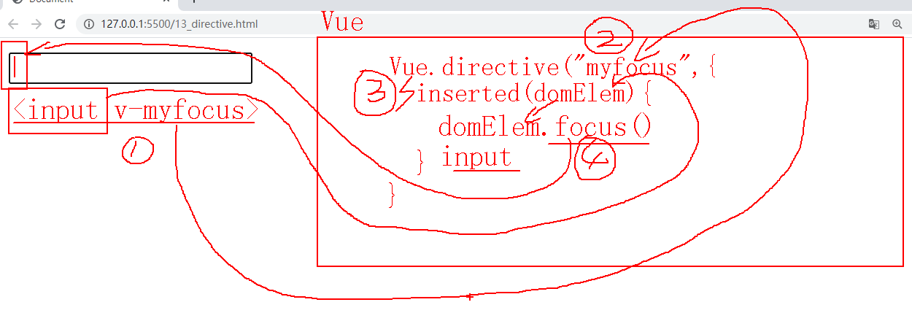

## day04

### 一 计算属性

1. 问题: 有时页面上要显示的值, 后端并没有直接给出, 但是却可以根据给出的其它变量值经过复杂的计算过程动态计算获得.

2. 解决: 2 种

   - (1). 不好的办法:
      - a.

         ```js
         methods: {
               自定义函数() {
               计算过程;
               return 返回值;
               }
         }
         ```

      - b. `<元素> {{自定义函数()}}</元素>`
      - c. 问题: 如果页面上需要反复多次显示计算结果, 如果调用自定义函数, 就会多次反复计算. --没必要!效率低!

   - (2). 好的办法: 使用计算属性: 自己不保存值, 每次使用属性时, 都根据其他变量的值动态计算获得自己的属性值.
      - a. 定义计算属性:

         ```js
         new Vue({
               el: "#app",
               data: {...},
               computed: {
                  属性名() { // 计算属性, 本质/形式却是一个函数
                     计算过程;
                     return 返回值;
                  }
               }
         })
         ```

      - b. 在界面中使用计算属性.
        `<元素>{{计算属性名}}</元素>`
        强调: 在绑定语法中使用计算属性时, 一定不要加().
      - c. 优点: Vue框架会缓存计算属性的结果.
        - 1). 只要计算属性以来的其他变量值不变, 则无论反复使用多少次该计算属性, 也只在首次使用时计算一次. 之后每次使用其实都是从缓存中获取旧值. --避免重复计算,效率高!
        - 2). 除非计算属性依赖的其它变量值发生了变化, vue框架才会重新计算一次计算属性的值, 并再次缓存起来, 反复使用!

3. 总结:
   - (1). 今后如果更偏重于使用一个计算结果值时, 首选计算属性.
   - (2). 今后, 如果仅偏重于执行一项任务, 而不关心返回值时, 首选函数.
         比如: 添加/删除/修改等服务器端相关的操作.

4. 案例: 使用计算属性, 计算购物车总价.
      [源码参考: 04-day/01-computed.html]

### 二 过滤器

1. 问题: 有些服务器端保存的数据, 不能直接给人看! 需要加工后, 人才能看懂!

   比如: 性别, 服务器端保存的是1 和 0, 人能看懂的是男和女.
   日期和时间, 服务器端保存的是毫秒数, 人可定看不懂! 必须转为年月日才能看.

2. 解决: 过滤器
   专门将变量的原始值加工后再显示出来的特殊的函数.

3. when: 今后只要一个变量的原始值必须经过加工后才能给人看时, 就用过滤器.

4. where: 2步

   - (1). 定义过滤器:

      ```js
      Vue.filter("过滤器名", function(oldVal){
         return 加工后的新值
      })
      ```

      说明: Vue.filter()是为整个vue大家庭添加一个过滤器的意思. 我们创建一个过滤器, 其实可以在项目中任意位置使用!

   - (2). 使用过滤器加工变量的原始值:

      ```html
      <元素>{{变量 | 过滤器}}</元素>
      ```

5. 案例: 使用过滤器翻译性别的1和0为男和女.
      [源码参考: 04-day/02-filter.html]

6. 过滤器也可以传入自定义参数值:

   - (1). 问题: 有时过滤器最终过滤出什么结果, 希望也可以用参数值来控制.
   - (2). where: 2步
      - a.

         ```js
         Vue.filter("过滤器名", function(oldVal, 自定义形参, ...){
               return 加工后的新值
         })
         ```

      - b.

         ```html
         <元素>{{变量 | 过滤器(自定义实参名)}}</元素>
         ```

   - (3). 案例: 使用过滤器的参数控制转为中文性别或英文性别.
         [源码参考: 04-day/03-filter_parameters.html]

7. 多个过滤器连用:

      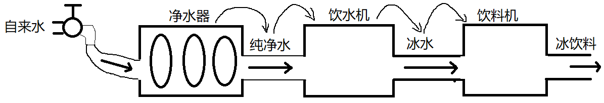

   - (1). `<元素>{{变量 | 过滤器1 | 过滤器2 | ...}}</元素>`

   - (2). 强调: 只有过滤器1有机会拿到变量的原始值. **之后的其他过滤器拿到的都不是元素值** , 而是前一个相邻的过滤器返回的中间产物!

   - (3). 案例: 显示性别名称之后, 追加显示性别图标
      [源码参考: 04-day/04-filter_some.html]

### 三 axios

1. 今后所有的函数库或框架都提供专门的发送ajax请求的函数. 从此发送任何ajax请求, 只需要一句话即可!

2. vue中发送ajax请求, 都用axios函数库: 专门发送ajax请求的基于 Promise 的函数库.

3. 问题:

   - (1). axios不是vue官方开发的, 但却是vue官方强烈推荐使用的, 所以需要先下载才能使用.

   - (2). axios不是vue专用的, 即使没有vue, 在其他平台比如nodejs服务器端也可以发送http请求.

4. where:

   - (1). 配置axios对象的服务器端借口地址的公共基础地址部分.
      `axios.defaults.baseURL="服务器基础地址"`

   - (2).

      ```js
      axios.get() {
         "服务器端借口的相对路径",
         {
            params: {参数名: 参数值}
         }.then(result => { // 会在前一步请求结束后自动执行
             // 跳坑: result不是直接的响应结果
             // result.data才是真正的响应结果
         })
      }
      ```

   - (3).

      ```js
      axios.post(
         "服务器端接口的相对路径",
         "变量名1=变量值&变量名2=变量值&..."
      ).then(result => { // 会在前一步请求结束后自动执行
         // 跳坑: result不是直接的响应结果
         // result.data才是真正的响应结果
      })
      ```

5. 问题: axios的`.then()`中的function(){}是回调函数, 其中的this默认指向window, 为我们如果想操作data中的变量时, 希望this -> 当前的new Vue()对象!

   解决: 今后在new Vue()内使用axios时, .then()中必须使用 **箭头函数** ! 让回调函数内外 this 相同, 都指向new Vue()对象.

6. 案例: 使用axios向天哥新浪云服务器发送请求
   [源码参考: 04-day/05-axios.html]

   注意:这里通过Live Server访问, 而不是直接点击该文件运行

### 四 生命周期

1. 问题: DOM和jQuery中, 如果希望在页面加载完成后自动执行一段代码, 这段代码应该放在domContentLoaded或load两个事件处理函数中! 但是new Vue()没有domCOntentLoad和load事件处理函数, 那么我们希望在页面加载时自动执行一项操作(比如自动发送ajax请求), 应该写在哪儿呢?

2. 答: 其实new Vue()和DOM中的网页一样, 也有 **加载过程** . 在加载过程的不同阶段, 也可以自动触发一些函数的执行. --vue的生命周期.

3. vue的生命周期包括: 4个阶段! (2个必经阶段, 2个特定情况下才触发)

   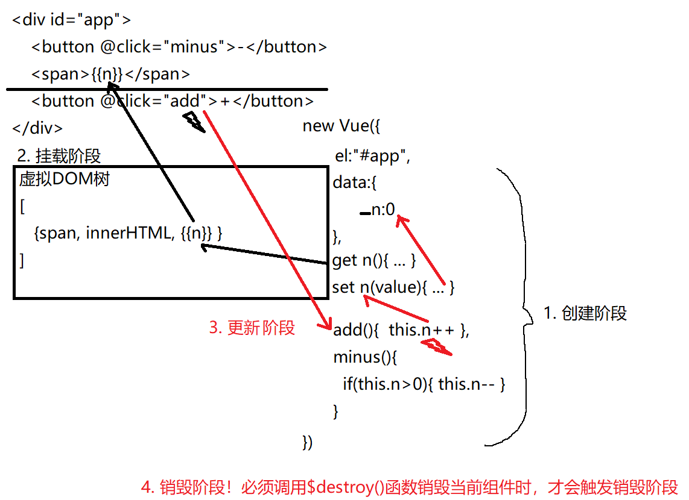

   必经阶段:

   - (1). 创建(create)
      - a. 创建new Vue()对象, 以及data对象, 以及data对象中的变量--可以操作data中的变量.
      - b. 暂时没有扫描DOM树, 也就没有虚拟DOM树--但是暂时无法操作DOM树上的元素.

   - (2). 挂在(mount)
      - a. 已经有data对象--既可操作data中的变量
      - b. 扫描真实DOM树, 生成虚拟DOM树, 并首次加载数据到页面元素--有可操作DOM树上的元素.

   特定情况阶段

   - (3). 更新(update): 只有new Vue()中的程序修改了data中的变量时, 并影响了页面中的内容, 才会出发更新阶段!

   - (4). 销毁(destroy): 只有手动调用$destroy()函数, 销毁当前组件时, 才会进入销毁阶段.

4. 问题: 生命周期阶段只是个名称, 不是函数, 也无法写代码.

   解决: 其实当new Vue()进入每个阶段前后, 都会自动出发一组固定的函数--钩子函数. 如果我们将希望在某个阶段执行的操作代码, 放入特定的钩子函数中, 就可在new Vue()加载过程中, 经历到某个阶段时, 自动调用执行!

5. new Vue()共包含8个生命周期钩子函数:

      在进入创建阶段前会自动触发: beforeCreate(){...}

   - (1). 创建(create)
      在离开创建阶段后会自动触发: created(){...}
      在进入挂在阶段前会自动触发: beforeMount(){...}

   - (2). 挂载(mount)
      在离开挂载阶段后会自动触发: mounted(){...}
      在进入更新阶段前会自动触发: beforeUpdate(){...}

   - (3). 更新(update)
      在离开更新阶段后会自动触发: updated(){...}
      在进入销毁阶段前会自动触发: beforeDestroy(){...}

   - (4). 销毁(destroy)
      在离开销毁阶段后会自动触发: destroyed(){...}

6. 用的绝对多的!只有一个!mounted(){...}

   因为此时, new Vue()中既有data对象, 又有虚拟DOM树, 即可操作data中的变量, 又可操作DOM树上的元素.

   比如: 今后,希望在页面加载时就自动发送的ajax请求代码都应该卸载mounted()中.

7. 案例: 在vue生命周期钩子函数中发送axios请求, 并且修改data中的变量.
   [源码参考: 04-day/06-lifecycle.html]

   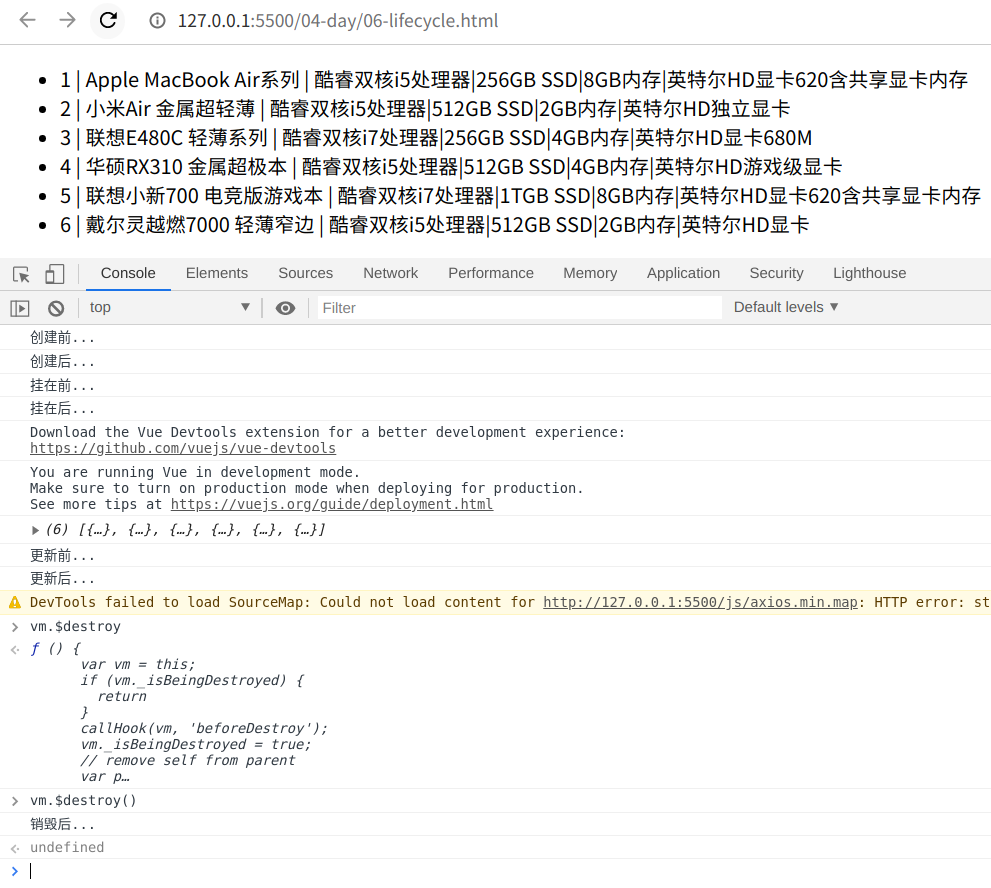

### 五 组件

1. what: 拥有专属的HTML+JS+CSS+数据的, 可重用的页面独立功能区域

2. 用途: 提高代码复用率!

3. when: 今后只要页面中一个功能, 会被反复使用, 都要封装为组件.

4. where:

   ```js
   // 向vue大家庭中添加一个自定义组件
   Vue.comonent("组件名", {
      // 每个组件对象, 其实都是一个缩略版的new Vue()
      // 所以几乎new Vue()中有什么, 组件对象中, 就有什么
      // 但是稍微有一点差别: 2个
      // 1. 组件对象中不写el: "#app"
      template: `组件的HTML内容模板`, // 将来在页面中使用了几次组件, 这个模板就会在页面中反复创建几次一抹一样的元素!
      // 2. 组件对象中不写data: {}, 而是写data() {return {}}
      data() { // 将来在页面中使用了几次组件, vue就会自动反复调用几次data函数, 返回几个模型对象的副本. --保证每个组件副本都有专属的数据模型对象, 互不干扰!
         return { // new Object
            // 每个组件需要的变量和初始值
         }
      },
      // =====以下都是一样的=====
      methods: {...},
      computed: {...},
      mounted: {...},
      ...: ...
   })
   ```

   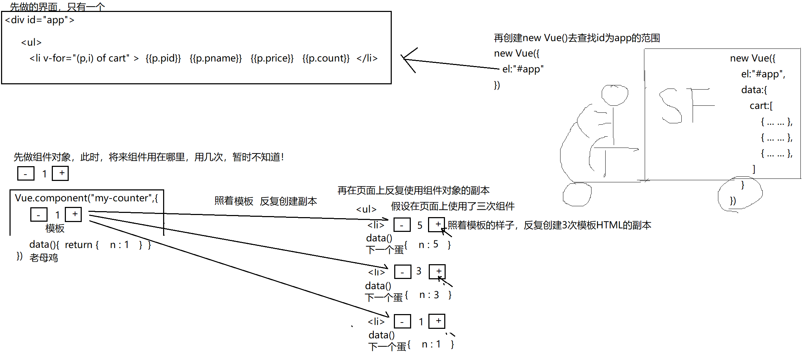

5. 如何使用组件:

   - (1). vue中的组件在使用上, 其实就是一个 **可重用的自定义HTML标签** 而已! 组件名叫什么, 标签名就叫什么.

   - (2). 强调: 因为组件名就是将来的标签名, 又因为HTML语言不区分大小写, 所以如果组件名使用驼峰命名, 到了HTML中是区分不出来的! 所以, 组件名如果包含多个英文单词, 应该使用 `-` 分隔, 而不是用驼峰命名!

      比如: 在HTML中`<myCounter>`, `MYCOUNTER>`, `<mycounter>`其实是同一个标签!

6. 原理:

   - (1). new Vue()在扫描页面时, 发现不认识的标签, 就会去vue大家庭中查找是否有同名的自定义组件

   - (2). 只要找到同名的自定义组件, 就会先用组件的template中的HTML中的HTML片段代替页面中不认识的标签的位置.

   - (3). 为了这个区域临时创建一个缩略的vue对象的副本:
      - a. 自动调用自定义组件中的data(), 为了这个组件副本创建一个专属的data对象保存专属的数据
      - b. 引入组件对象中规定的methods等其他函数.

   - (4). 结果: 界面中的一个自定义标签, 就变成了一个缩略的小的功能区域!
  
      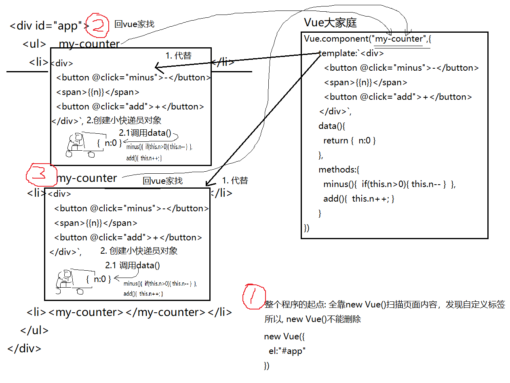

7. 案例: 定义一个点+/-号, 数量增减的组件, 并在页面中反复使用.
   [源码参考: 04-day/07-cmponent.html]

### 六 组件化开发

1. what: 将来所有的网页其实都是有组件拼成的! 将来我们拿到一个网页之后不是立刻开始编码, 而是先将网页内容划分为多个组件, 然后再多人分工协作开发出一个页面!

2. 原因:

   - (1). 现代的前端开发, 网页内容和开发难度都极大增加!
   - (2). 组件化开发可以把一个网页拆分为多个组件, 由多人协作开发! --极大的提高了开发效率.
   - (3). 一个组件出错, 不影响整个页面的加载和使用! --低耦合.

3. when: 今后大型的网页都应该使用组件化开发

4. where:

   - (1). 拿到网页之后, 先将网页内容划分为多个独立的功能功能区域.
      划分的原则: 2个
      - a. 从上到下, 从左到右, 从外到内的区域顺序.
      - b. 是否会被重用!

   - (2). 每个组件都是一个独立的js文件, 其中包含一个组件对象的自定义.

   - (3). 父级组件中使用组件标签引用子级组件

   - (4). 讲所有组件`.js`文件引入到HTML文件中, 在`<div id="app>内</div>`使用父级组件的标签, 引入整个组件内容.

5. 问题: 子组件必须在其规定的父组件内使用才有意义, 但是Vue.component()创建的组件, 在哪里都能随意使用, 没有限制!

6. 解决: 其实, vue中的组件分为三大类:

   - (1). 根组件(root component): new Vue()这个网页, 甚至整个项目只有一个!

   - (2). 全局组件: 可在任意位置使用的组件, 没有限制. `Vue.component(...)`

   - (3). 子组件: 仅限制在其父元素内才能使用的组件
      - where:
         - a. 创建子组件对象:

            ```js
            var 组件对象名(驼峰命令) = { // 普通对象
               // 但是内容却必须符合组件的要求
               template: `xxx`,
               data() {return {...}},
               ... ...
            }
            ```

         - b. 在其父组件内使用`compontents`属性, 标记哪个子组件属于哪个父组件:

            ```js
            父组件 {
               template: `xxx`,
               data() {return{...}},
               methods: {...},
               ... ...,
               components: {子组件对象名(驼峰)} // 比如: todoList -> <todo-list></todo-list>, components可自动将驼峰命名翻译为 - 分隔
            }
            ```

         - c. 结果: 在福组件的template中, 可以使用子组件标签名(-分隔), 引入子组件的内容
         - d. 强调: 将组件引入页面时, 子组件必须在其父组件之前引入!
            因为: 父组件的components属性中已经要使用子组件对象了!

7. 案例: 使用组件化开发的方式实现待办事项列表
   [源码参考: 04-day/08-todo/01-todo.html]

   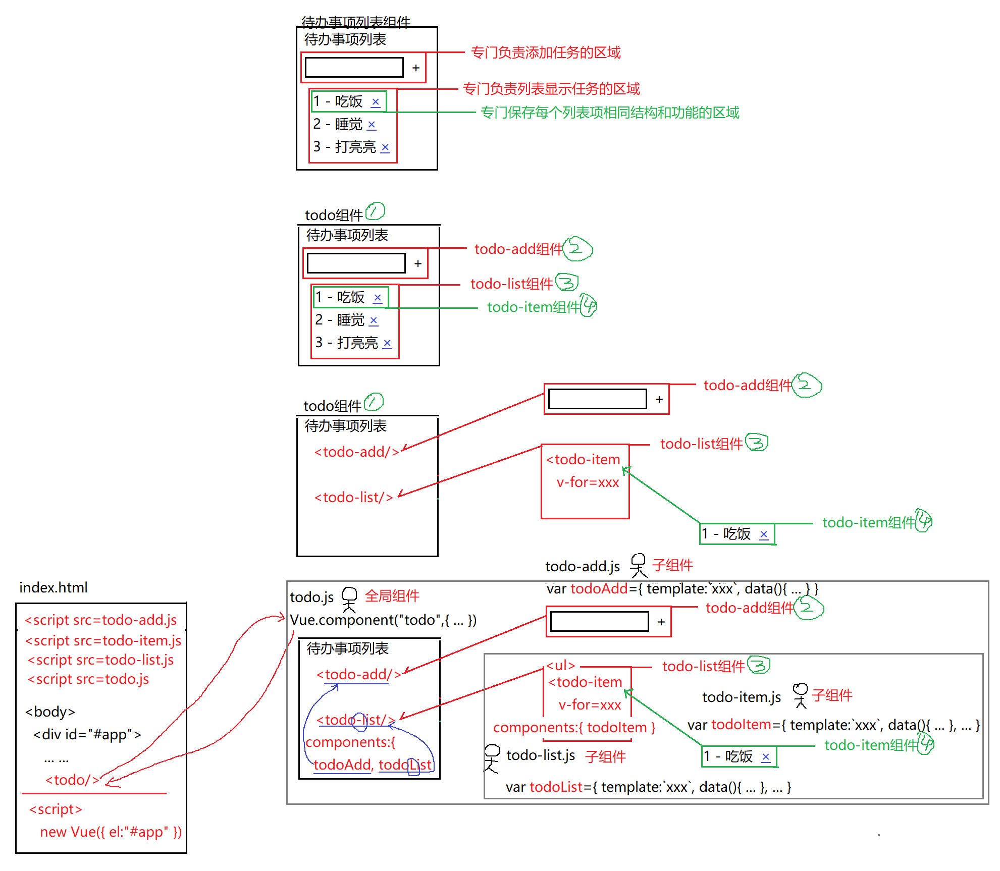

8. 组件间传参: 父给子

   - (1). 问题: 如果多个组件需要共享数据, 应该放在哪里?

   - (2)错误的做法: 仅放在父组件中, 指望通过继承关系, 子组件顺理成章的可以直接使用父组件中的变量.
      原因: Vue中组件是拥有专属的HTML + JS + 数据的独立功能区域. 组件与组件之间毫无关系!

   - (3). **正确的做法** : 将数据放在父组件中, 但是要通过专门的手段让父组件把数据传递个给子组件 --组件间传参!

   - (4). where: 2步

      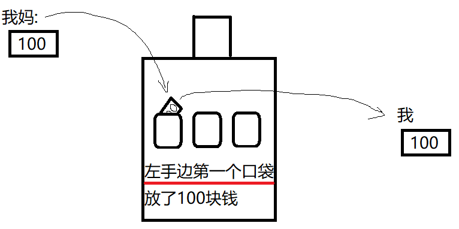

      - a. 父组件放: 在父组件的template中的子组件的标签上

         ```js
         Vue.component("父组件名",{
            template: `<子组件 :自定义属性名="父组件变量名"></子组件>`,
            data() {
               return {
                  父组件变量名: 值
               }
            }
         })
         ```

      - b. 子组件取: 在子组件对象中添加`props`属性

         ```js
         子组件对象: {
            ... ...
            props: ["自定义属性名", ...], // 意为: 从子组件身上，父组件装数据的同名属性(口袋)里取出父组件给的变量值
            ... ...
         }
         ```

## day05

### 一 SPA

### 二 脚手架

### 三 懒加载
